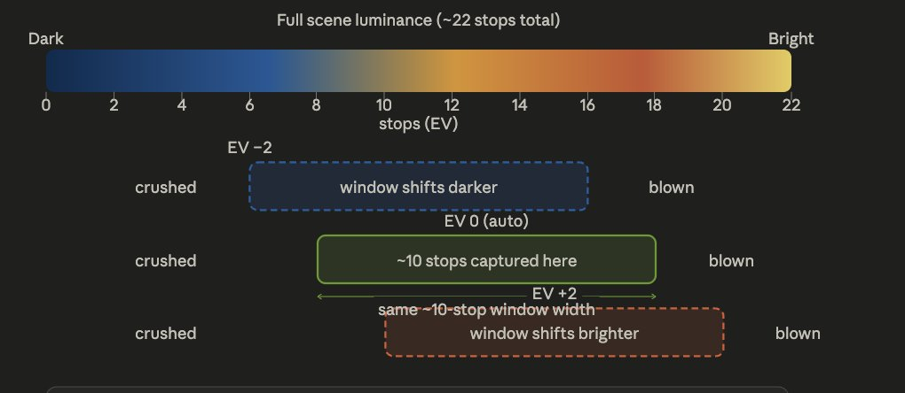

# SDR & HDR - The physics behind light

while i'm at invideo.ai, both @dataBiryani and @_anshulk introduced me to this problem of converting a SDR video to HDR, though we started with initial work on this, we couldn't take it forward on time and deprioritised this work for other things. Now after 6 months watching LTX release these models I kind of thought i will write about our initial research on the same topic. Let's start.

To understand the difference between SDR and HDR we need to understand how camera's work. At each pixel within a camera, light arrives as a stream of photons. This photon flux hits a silicon photodiode, and each absorbed photon frees an electron inside the silicon, generating charge. These electrons collect in a potential well, where they're converted to a voltage, and that voltage is then quantized and stored. There are noises and optimizations at every stage, but this is the crux of how a camera captures scene information — and it's essentially what your .raw file contains.

The potential well is the heart of it. Every photosite can hold only so many electrons before it's full — that ceiling is its capacity. Two controls decide how much light lands in the well, and therefore how full it gets. The aperture is the lens opening, set by the f-number: a smaller f-number means a wider opening and more light. The shutter speed is how long the sensor is allowed to collect light: long for dark scenes like astrophotography, very short to freeze fast motion.

Here's the trap: EV is one global setting for the entire frame. A scene with both a bright sky and deep shade forces a choice. Expose for the sky and the shadows fall into noise; expose for the shadows and the sky blows out. A single exposure can't hold both ends at once.

That limit has a name — dynamic range. It's the ratio between the brightest light a camera can record before its wells saturate (B_max) and the faintest it can register above the noise floor (B_min):

## Dynamic Range
The dynamic range of a camera is defined as 

$$
20 \log \frac{B_{max}}{B_{min}} 
$$

B_max is the saturation point from the diagram above, and B_min is the noise floor. The wider this ratio, the bigger the band of brightness a camera can hold in one shot (you'll also see it quoted in "stops," where each stop is one EV — a doubling of light). When a scene's range of light is wider than the camera's dynamic range, something has to give, and that "something" is exactly the blown highlights or crushed shadows from before.

The sun itself might be hitting 100,000 cd/m² (candelas per square metre — the unit of luminance). The shadowed alley around the corner might be 0.01 cd/m². That ratio is 10 million to one, which is roughly 23 stop.Your eye handles this continuously, partly by physically dilating the pupil, partly by the retina adapting over time, and partly because your brain stitches together local adaptations across the visual field. 

my iphone 13 mini has EV settings from -2 to 2 and roughly the following is what it means. It can capture 10 stops of light at a time and we can slide through it  by setting different EV values. So one of the way to capture this high dynamic range is to capture images with different EV values and then merge them into one frame. debevec is one of the first person to do it

------------ 

[Need editing from here]

## Capturing an HDR image
There are different approaches to it, we will discuss 3 influencial papers in short here. 
- [Debevec](https://www.cs.princeton.edu/courses/archive/fall14/cos526/papers/debevec97.pdf) first launched the paper in 1998. Here he first captured both in film and digital photographs at different EV values. Then found inverse camera response function to map output 8 bit image values to scene radiance values. Then using a weighted average they combine all the images into single HDR scene radiance. this is then using CRF function is mapped back to 10-12 bit image. There is a small preprocessing required when capturing the images. 
- Google launched [burst photography](https://static.googleusercontent.com/media/hdrplusdata.org/en//hdrplus.pdf) for obtaining high dynamic range. This is integrated into the camera ISP, so u don't need inverse CRF, we capture a burst of images from raw images 

## HDR to SDR image
In the latest imaging pipelines once an HDR image is captured the camera automatically does demosaicing, white balance and noise removal. Tone mapping is done and then content is moved to different formats 
- **sRGB / JPEG (for display)** — applies a gamma ~2.2 curve. This is designed to match how CRT displays worked historically and happens to roughly match human perceptual sensitivity. Compresses 12+ stops into 8 bits
- **Log formats (S-Log3, LogC3, C-Log)** — for cinematographers — this is where your question lands. The fundamental insight is that human vision perceives brightness logarithmically — one stop of light (doubling of radiance) feels like roughly the same perceptual step whether you're in shadows or highlights. So log encoding maps each stop of scene radiance to roughly equal code values. The result is that:
    - Shadows get more bits allocated (they'd otherwise be crushed)
    - Highlights retain detail instead of clipping
    - A colorist can re-expose, lift shadows, or pull highlights in post without destroying quality

S-Log3 (Sony), LogC3 (ARRI — the one in the LumiVid paper), C-Log (Canon) are all variations of this idea, each tuned to their camera's specific sensor dynamic range and color science.

**PQ / HLG (for HDR displays)** — these are perceptual encodings standardized for HDR TVs and phones, designed to match the absolute luminance the human visual system can perceive from a display.

## SDR to HDR image. 
Now that we understand the entire pipeline of how an HDR image is captured and how it is toned down to 

## Why HDR now?

## Resources 
[Burst Photography for High Dynamic Range and Low-Light Imaging on Mobile Cameras](https://static.googleusercontent.com/media/hdrplusdata.org/en//hdrplus.pdf)