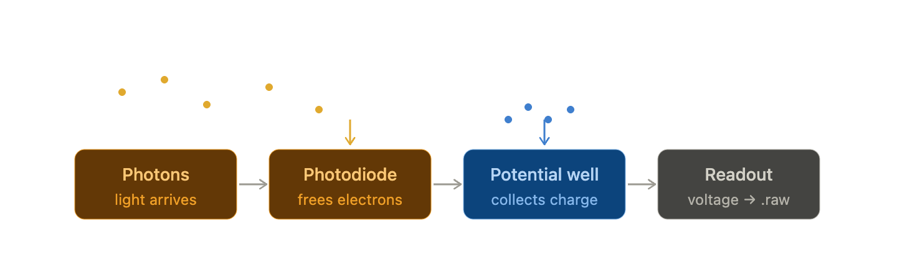
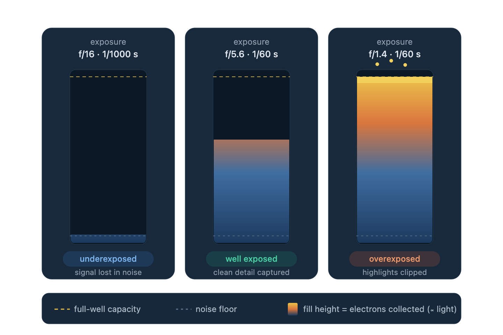
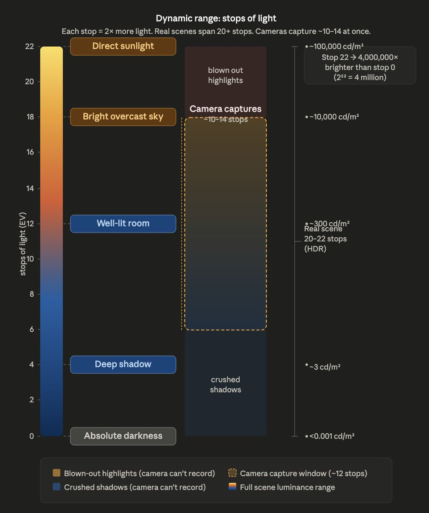
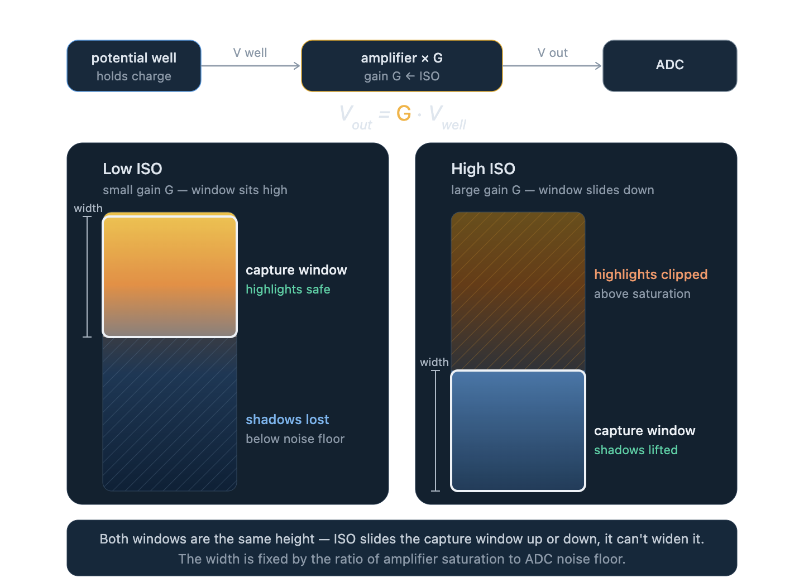
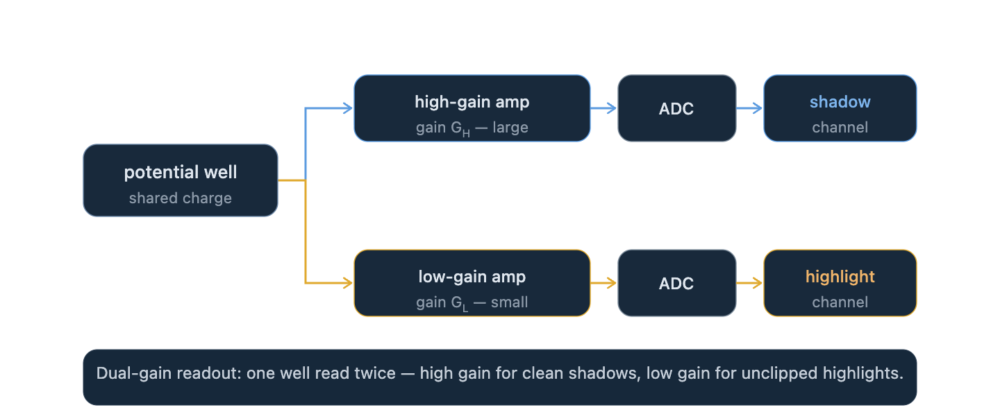

# How HDR images and videos are captured

A modern camera can't capture a sunlit street and a shadowed alley in the same frame — the physics won't allow it. High Dynamic Range (HDR) imaging is the set of techniques, from sensor design to software, that work around that limit. This post traces the problem from first principles — how a photosite works, why dynamic range is finite, and why small pixels make it worse — then walks through three distinct engineering solutions: Debevec's multi-exposure bracketing, Google's burst-merge approach in HDR+, and ARRI's dual-gain sensor for video.

## Sections
1. [How cameras work](#how-cameras-work)
2. [Exposure Value (EV) and ISO](#exposure-value-ev-and-iso)
3. [Dynamic Range](#dynamic-range)
4. [The low-light problem on mobile cameras](#the-low-light-problem-on-mobile-cameras)
5. [Capturing an HDR image: Debevec's approach](#capturing-an-hdr-image-debevecs-approach)
6. [Google HDR+: burst photography at constant EV](#google-hdr-burst-photography-at-constant-ev)
   - [Noise averaging: the math](#noise-averaging-the-math)
   - [The underexposure strategy](#the-underexposure-strategy)
   - [Auto-exposure](#auto-exposure-how-google-decides-how-much-to-underexpose)
7. [Capturing an HDR video](#capturing-an-hdr-video)
   - [Dual-gain readout: the hardware solution](#dual-gain-readout-the-hardware-solution)
   - [How this reaches 17 stops](#how-this-reaches-17-stops)
8. [Resources](#resources)

---

## How cameras work
At each pixel within a camera, light arrives as a stream of photons. This photon flux hits a silicon photodiode, and each absorbed photon frees an electron inside the silicon, generating charge. These electrons collect in a potential well, where they're converted to a voltage, and that voltage is then quantized and stored. There are noises and optimizations at every stage, but this is the crux of how a camera captures scene information — and it's essentially what your .raw file contains.

The potential well is the heart of it. Every photosite can hold only so many electrons before it's full — that ceiling is its capacity. Two controls decide how much light lands in the well, and therefore how full it gets. The aperture is the lens opening, set by the f-number: a smaller f-number means a wider opening and more light. The shutter speed is how long the sensor is allowed to collect light: long for dark scenes like astrophotography, very short to freeze fast motion.

## Exposure Value (EV) and ISO

Aperture and shutter speed are two separate physical controls, but a camera needs a single number to describe how much light is reaching the sensor. That number is the **Exposure Value (EV)**:

$$
EV = \log_2 \frac{N^2}{t}
$$

where $N$ is the f-number and $t$ is the shutter speed in seconds, at a reference sensitivity of ISO 100. Each +1 EV halves the light (smaller aperture or faster shutter); each −1 EV doubles it.

**ISO** is the third exposure control — the electronic gain applied to the signal after the potential well is read out. It doesn't change the physics of how many photons hit the sensor; it amplifies the resulting voltage before digitization. A higher ISO makes dim scenes recordable, but it amplifies noise in equal measure. Factoring ISO in, the adjusted EV is:

$$
EV_{\text{adj}} = \log_2 \frac{N^2}{t} - \log_2 \frac{\text{ISO}}{100}
$$

A higher ISO lowers the EV needed to achieve a given brightness — the sensor is effectively more sensitive. We'll return to what ISO does at the hardware level in the video section, where it becomes central to understanding HDR video capture.

Here's the trap: EV is one global setting for the entire frame. A scene with both a bright sky and deep shade forces a choice. Expose for the sky and the shadows fall into noise; expose for the shadows and the sky blows out. A single exposure can't hold both ends at once.

That limit has a name — dynamic range. It's the ratio between the brightest light a camera can record before its wells saturate (B_max) and the faintest it can register above the noise floor (B_min):

## Dynamic Range
The dynamic range of a camera is defined as 

$$
\log_{2} \frac{B_{max}}{B_{min}} 
$$

B_max is the saturation point from the diagram above, and B_min is the noise floor. The wider this ratio, the bigger the band of brightness a camera can hold in one shot (you'll also see it quoted in "stops," where each stop is one EV — a doubling of light). When a scene's range of light is wider than the camera's dynamic range, something has to give, and that "something" is exactly the blown highlights or crushed shadows from before.

The sun hits around 100,000 cd/m² (candelas per square metre — the unit of luminance). The shadowed alley around the corner might be 0.01 cd/m². That ratio is 10 million to one, which is roughly 23 stop.Your eye handles this continuously, partly by physically dilating the pupil, partly by the retina adapting over time, and partly because your brain stitches together local adaptations across the visual field. 

## The low-light problem on mobile cameras

Before jumping to HDR solutions, it helps to understand a constraint specific to smartphone cameras: they have small pixels.

A typical smartphone photosite is around 1–1.5 µm across. A full-frame DSLR photosite is 4–8 µm. Area scales as the square, so a smartphone well holds roughly 10–40× fewer electrons at saturation. That shrinks B_max considerably. But the more painful effect is in low light.

When photons arrive at a photosite, the process of converting them to electrons is inherently random — each photon has a probability of being absorbed. This randomness follows a Poisson distribution. If the true expected signal is $S$ electrons, the actual count fluctuates with a standard deviation of $\sqrt{S}$. This is called **photon shot noise**, and it is a physical limit you cannot engineer away.

The single-frame SNR from shot noise alone is:

$$
\text{SNR} = \frac{S}{\sqrt{S}} = \sqrt{S}
$$

In good light, $S$ is large (the well is mostly full) and SNR is high. In dim light, $S$ is small — and SNR collapses. A pixel collecting 4 electrons has SNR = 2. A pixel collecting 100 electrons has SNR = 10. Doubling your light (one stop) only improves SNR by $\sqrt{2} \approx 1.4\times$.

The obvious hardware fix is a wider aperture — more photons per unit time. But a smartphone is thickness-constrained. You cannot make the lens meaningfully faster. The next option is a longer shutter — but that introduces motion blur for handheld or action shots. Small pixels, physics, and form factor together create the low-light noise problem that no single-exposure pipeline can cleanly escape.

## Capturing an HDR image: Debevec's approach

My iPhone 13 mini's sensor captures roughly 10 stops of dynamic range in a single frame. Its exposure compensation range of −2 to +2 EV lets you shift that 10-stop window up or down by 4 stops — protect highlights at the cost of darker shadows, or vice versa — but the window stays 10 stops wide regardless. One approach to capturing a scene wider than 10 stops is to shoot the same scene multiple times at different EVs — short exposure for the highlights, long exposure for the shadows — and merge them into a single radiance map.

[Debevec & Malik (1997)](https://www.cs.princeton.edu/courses/archive/fall14/cos526/papers/debevec97.pdf) were among the first to formalise this. Their method recovers the inverse camera response function — the mapping from 8-bit output values back to physical scene radiance — and then uses a weighted average across exposures so that each region of the image is contributed mostly by the frame where it was best exposed (not clipped, not in noise). The result is a linear HDR radiance map of the scene.

**Where Debevec fails.** The approach assumes the scene is static between exposures. In practice it never is. A person walks through the frame, a leaf moves, a car passes. Because the short-exposure and long-exposure frames capture the scene at different moments, the same object appears in slightly different positions in each frame. When you merge them, you get **ghosting** — semi-transparent duplicates of anything that moved. Optical flow can partially correct this but it's expensive, often wrong on thin structures, and breaks down near occlusions. For a camera that needs to respond in under four seconds and run on a phone, Debevec's pipeline is too fragile.

## Google HDR+: burst photography at constant EV

Google's approach, published as [HDR+](https://static.googleusercontent.com/media/hdrplusdata.org/en//hdrplus.pdf), sidesteps the ghosting problem entirely by **never using different exposures**. The entire burst is shot at a single constant EV. This means all frames look the same to an alignment algorithm — no brightness discontinuities between frames — so alignment is robust even with subject motion. The motion ghosting problem disappears.

But if all frames are the same exposure, where does the dynamic range come from?

### Noise averaging: the math

Model a single pixel across N frames:

$$
\text{pixel}_i = S + n_i
$$

where $S$ is the true scene signal (constant across frames — the scene is the same) and $n_i$ is independent noise on frame $i$ with mean 0 and variance $\sigma^2$.

When you sum (or average) the N frames, signal and noise behave differently:

$$
\text{sum} = N \cdot S \; + \; \underbrace{(n_1 + n_2 + \cdots + n_N)}_{\text{noise sum}}
$$

Because noise terms are independent, **variances add**:

$$
\text{Var}(\text{noise sum}) = N\sigma^2 \implies \text{std dev} = \sigma\sqrt{N}
$$

Signal grew by $N$. Noise standard deviation grew by only $\sqrt{N}$. The SNR after merging:

$$
\text{SNR}_N = \frac{N \cdot S}{\sigma \sqrt{N}} = \sqrt{N} \cdot \frac{S}{\sigma}
$$

Merging N frames improves SNR by $\sqrt{N}$. Every 4× as many frames buys one extra stop of shadow you can recover. Google's pipeline merges 8–16 frames depending on scene brightness, giving 1.5–2 stops of effective noise floor reduction.

In the dynamic range formula this is a direct reduction of $B_{min}$:

$$
\Delta DR = \frac{1}{2}\log_2(N) \text{ stops}
$$

For $N = 16$: $\Delta DR = 2$ stops of extra shadow detail, recovered through computation rather than hardware.

### The underexposure strategy

HDR+ doesn't just merge at any exposure — it intentionally **underexposes** the burst to protect highlights. Setting the shutter short enough that the sky doesn't blow out means the shadows are darker and noisier than they'd otherwise be. But the burst merge cleans up those shadows. The result is a merged image with clean shadows (thanks to averaging) and intact highlights (thanks to underexposure) — spanning a wider luminance range than any single frame could hold.

This is the reframe: Google treats HDR capture as a **denoising problem**, not an exposure-bracketing problem. The dynamic range gain comes from lowering $B_{min}$, not from raising $B_{max}$.

After merging, the pipeline creates two virtual exposures from the single merged image — the underexposed version for highlights, and a digitally brightened version for shadows — and fuses them with local tone mapping. The shadows, now clean from merging, can be safely brightened without amplifying noise into visibility.

### Auto-exposure: how Google decides how much to underexpose

The remaining question is how much to underexpose. Too little and highlights clip. Too much and even 16 merged frames are too noisy in shadows. The paper caps the maximum dynamic range compression at **8× (3 stops)** — beyond that, the local tone mapping starts to look unnatural.

Within that cap, the exposure level is set by a **data-driven policy** trained on thousands of real scenes. The key insight is that the right answer is scene-dependent:

- In a daylight landscape, you can let the sun blow out — a white disc in the sky is expected and acceptable.
- In a beach sunset, the sun must stay coloured — any clipping there destroys the shot.
- A concert stage with a dark audience requires different shadow recovery than a snow scene.

The auto-exposure model learns these scene priors from a large image dataset, then applies them at capture time from a low-resolution preview frame. It outputs two numbers: the exposure to actually use (how short to set the shutter) and the synthetic gain to apply in post (how much to brighten shadows in tone mapping). These two are coupled — more underexposure means more post-processing brightening is needed, and the model learns to keep the combination within the range where the merged result looks natural.

The practical result: a user pointing a Pixel phone at a candle-lit room, a noon beach, or a neon-lit bar all get a correctly exposed result automatically, without understanding any of this.

## Capturing an HDR video

Still images have a luxury that video doesn't: time. Debevec could bracket across three separate shots. Google could stack sixteen frames from a burst. Neither of those are options when you're shooting at 24 fps.

At 24 fps you have **40 ms per frame** — that's your entire budget for capture, readout, and moving on. You cannot expose the same frame twice at different moments; by the time you've finished the first exposure, the scene has changed. A hand has moved. A leaf has shifted. The frame is gone. Any technique that requires temporal separation of exposures produces ghosting, and ghosting in video is unwatchable.

The problem then becomes: how do you capture 17+ stops of dynamic range from a single 40 ms window?

### What ISO actually is at the hardware level

We introduced ISO as electronic gain applied after readout. To understand how cinema sensors solve this, we need to go one level deeper — into exactly what that amplifier does, and why you can't simply turn it up to capture everything.

After photons hit the photosite and electrons accumulate in the potential well, the charge is converted to a voltage and sent to an **amplifier** before it reaches the analog-to-digital converter (ADC). ISO is the gain setting of that amplifier.

$$
V_{out} = G \cdot V_{well}
$$

where $G$ is the gain factor controlled by ISO, and $V_{well}$ is the voltage coming off the potential well.

- **Low ISO (low gain, $G$ small):** The amplifier barely touches the signal. A well full of electrons produces a large output voltage; a well with a few electrons produces a tiny one. Highlights are safe — the amplifier won't clip them. But deep shadows, which produce only millivolts off the well, come out below the noise floor of the ADC and vanish. The sensor captures a large luminance range but the bottom of it is lost to quantisation noise.

- **High ISO (high gain, $G$ large):** The amplifier boosts everything strongly. A well with a few shadow electrons now produces a large enough voltage to be cleanly digitised. Shadows become visible. But the same gain applied to a bright pixel — already producing a large well voltage — pushes the amplifier into saturation and clips the highlights. You've traded your highlight headroom for shadow sensitivity.

The tradeoff is symmetric and inescapable with a single amplifier: you can shift the dynamic range window up or down with ISO, but you cannot make it wider. The width is fixed by the ratio of amplifier saturation to ADC noise floor.

### Dual-gain readout: the hardware solution

The technique that breaks the single-amplifier deadlock is called **dual conversion gain** — documented in CMOS sensor literature and implemented across high-end cinema image sensors. It attacks both terms of the dynamic range equation simultaneously.

**Large photosites** raise $B_{max}$. Cinema sensors use physically larger photosites than consumer or broadcast sensors. A larger photosite has a bigger potential well — it holds more electrons before saturating, which directly extends the top of the dynamic range.

**Dual gain readout** is where the video HDR problem gets solved. Rather than one amplifier path per pixel, each pixel's well voltage is routed into **two separate amplifier paths simultaneously**, within the same 40 ms frame window:

Both reads happen at exactly the same instant, from the same accumulated charge in the well. There is no temporal gap — no ghosting is possible because neither read is "later" than the other.

The two channels capture complementary halves of the luminance range:

- **High-gain channel** ($G_H$ large): shadows are lifted above the noise floor and cleanly digitised. Midtones are clean. Highlights are clipped — the amplifier is saturated.
- **Low-gain channel** ($G_L$ small): highlights are intact and unclipped. Midtones are present. Shadows are below the ADC noise floor and lost.

The merge is then straightforward: for each pixel, use the high-gain reading for any luminance value where the high-gain channel hasn't clipped, and switch to the low-gain reading for anything above that threshold.

$$
\text{pixel}_{merged} = \begin{cases} \dfrac{V_H}{G_H} & \text{if } V_H < V_{clip} \\ \dfrac{V_L}{G_L} & \text{if } V_H \geq V_{clip} \end{cases}
$$

Both channels are expressed in the same units (electrons, or equivalently, scene radiance) by dividing out the respective gains. At the crossover point they represent the same physical signal, so the merge is seamless.

### How this extends dynamic range

Say the gain ratio between the two channels is $k = G_H / G_L$. Each channel individually captures roughly the same number of stops of dynamic range — call it $D$ stops. But they cover different parts of the luminance scale, offset by $\log_2(k)$ stops. The merged result covers:

$$
DR_{merged} \approx D + \log_2(k) \text{ stops}
$$

The gain ratio is tuned so the two windows overlap slightly in the midtones — ensuring a clean crossover — while the combined span pushes well beyond what either channel alone can hold. The large photosites contribute by raising $D$ independently: a bigger well means the high-gain channel alone already has excellent shadow sensitivity before the low-gain channel extends the top.

The result is a sensor that captures 14–17 stops of dynamic range from a single frame, at any frame rate, with no temporal artifacts — something no single-amplifier sensor can approach regardless of how carefully you set the ISO.

## Resources 
- [Debevec & Malik (1997)](https://www.cs.princeton.edu/courses/archive/fall14/cos526/papers/debevec97.pdf)
- [Burst Photography for High Dynamic Range and Low-Light Imaging on Mobile Cameras](https://static.googleusercontent.com/media/hdrplusdata.org/en//hdrplus.pdf)
- [How camera ISO works](https://www.youtube.com/watch?v=iiMfAmWbWSg)
- [Dual gain ISO](https://www.youtube.com/watch?v=8hpZY_WGpNY)